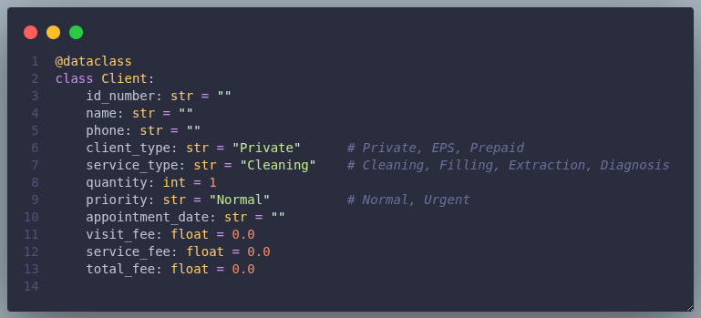
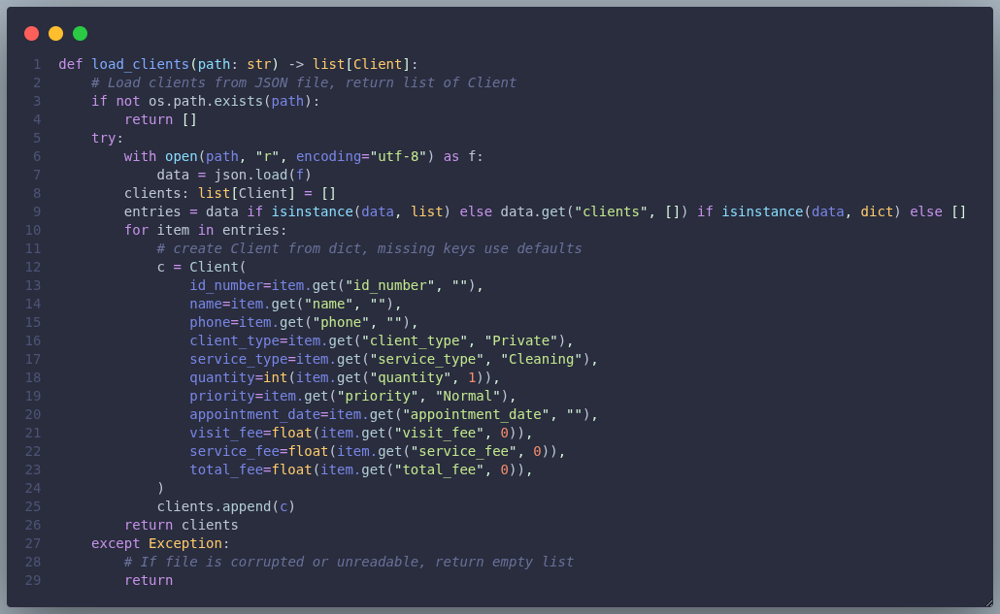

# *Dental Clinic — Python workshop*

This is a small, clear program made for learning. It handles basic client data for a dental clinic and keeps the records in a JSON file so data is kept between runs.

**What it does**

- *Register clients*: **ID, name, phone, client type, service, quantity, priority, appointment date.**
- *Calculate fees*: visit fee + service fee × quantity using the price table.
- *Show stats*: total clients, total revenue, number of extraction clients.
- *List clients*: sorted by total fee (high to low).
- *Search*: **find a client by ID.**
- *Persistence*: saves and loads `clients.json` automatically.

## Why this is useful

It's a neat example for **classes, data handling, simple validation, sorting and file I/O**. Not meant for production, but good for **practice and small demos**.

### Quick notes

- Input checks: phone format and date format are validated, duplicate IDs are blocked.
- Data format: JSON file `clients.json` at project root.
- `Client` is a `@dataclass` so serializing and reading back is straightforward:




## How to run

Open a terminal in the project folder and run:

```bash
python3 main.py
```

The program will try to load `clients.json` automatically on start. **When you register a client it saves the file.**

The `load_clients` functionality in `clinic.py` for information persistence:





# Project files

- `main.py`— CLI and input handling.
- `clinic.py`— business logic (**price table, calculations, save/load, search, sort**).
- `client.py`— `Client` dataclass.
- `clients.json` — created automatically when you save clients.

## About this version

This implementation was developed with the support of an AI assistant for code corrections, formatting and strengthening. **VS Code's AI helped review and improve validation, structure, and persistence**, but all final decisions were implemented by the author.


## License

Free to use for teaching and learning.
